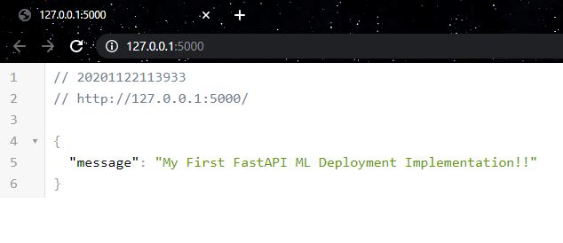
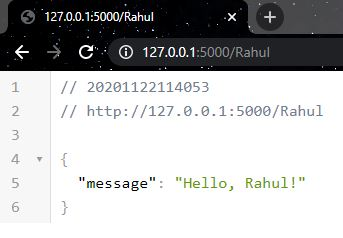
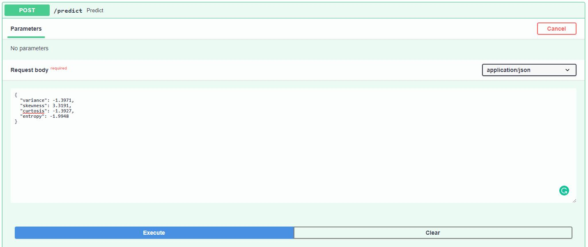
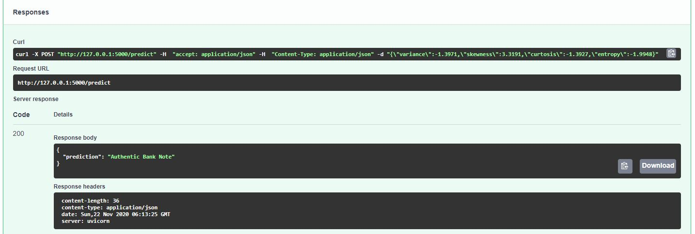

# FastAPI ML Deployment

Here I'm deploying a simple ML model in [Heroku](https://heroku.com/) platform using [FastAPI](https://fastapi.tiangolo.com/).

Deployment Link: [Swagger UI](https://fastapi-ml-demo.herokuapp.com/docs)

# Run

1. Directly running the `app.py` file:
```
py app.py
```
2. Running `app.py` using `uvicorn` CLI:
```
uvicorn app:app --reload --port 5000 --host 127.0.0.1
```

# Snapshots

### Index Page <br>


### Random String Input <br>


### ML Model Request Message <br>


### ML Model Response Message <br>


The last two images are from the Swagger UI/OpenAPI UI provided by FastAPI.

## Contact Author

Name : Rahul Bordoloi <br>
Website : https://rahulbordoloi.me <br>
Email : rahulbordoloi24@gmail.com <br>

[](https://www.python.org/)
[](https://gitHub.com/rahulbordoloi/)